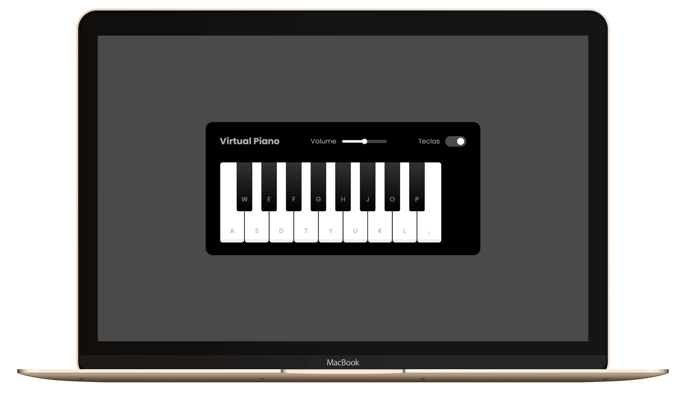

# Entrega de projeto - Construindo um Simulador de Piano com JavaScript e CSS | DIO

Construir um simulador de piano totalmente funcional no seu navegador, aproveite para aprender mais sobre HTML, CSS e o poder de manipulação do DOM do Browser através de JavaScript e como interagir com áudios.

## Objetivos

- Criar um layout de piano utilizando HTML e CSS
- Implementar a lógica do piano com JavaScript
- Utilizar eventos JavaScript para detectar interações do usuário
- Manipular áudios no navegador para simular o som das teclas do piano

## Tecnologias Utilizadas

- `index.html`: Arquivo principal do HTML.
- `style.css`: Arquivo de estilos CSS.
- `script.js`: Arquivo principal de JavaScript.

## Funcionalidades

- HTML e CSS: Estrutura e estilos do simulador de piano.
- JavaScript: Lógica do simulador, incluindo a detecção de cliques nas teclas e a reprodução de sons.
- Eventos JavaScript: Interatividade com o usuário através de eventos de clique e teclas do teclado.
- Manipulação de Áudio: Reproduzir sons correspondentes às teclas do piano.

## Como Executar o Projeto

1. Clone o repositório:

   ```bash
   git clone https://github.com/fabiocasadossites/desafio-javascript-simuladorPiano-dio.git
   ```

2. Navegue até o diretório do projeto:

   ```bash
   cd nome-do-repositorio
   ```

3. Abra o arquivo index.html

<br>

### Veja o projeto

[Link do projeto](https://fabiocasadossites.github.io/desafio-javascript-simuladorPiano-dio/)
